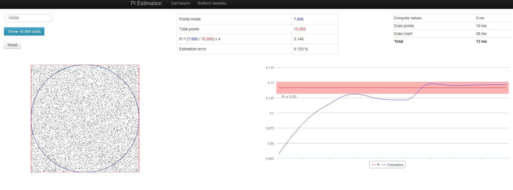

Pi estimations 
======================== 

This small Javascript application illustrates the concept of Monte Carlo method used to calculate the value of Pi. 
It is hosted here: 
* http://www.olivettom.com/pisimulation 

It works with HTML5 canvas so make sure you use a compatible browser. 
To run it, simply extract it locally and open monte-carlo.html in your browser. 

 

Monte Carlo method 
------------------------ 

Consider a square with side equals one. Now consider a circle within the square. 
* Square area is 1*1 = 1 
* Circle radius is 0.5 so the area is Pi x Radius x Radius = Pi/4 

By randomly drawing points on the board (think of throwing darts on a dartboard) we know that the ratio of points in the circle compared to the number of total points is Pi/4. 
Multiply the ratio by 4 to get an approximation of Pi value. 

* https://en.wikipedia.org/wiki/Monte_Carlo_method 

The second tab illustrates another method for estimationg Pi: Buffon's Needles 
THe math is explained here: 
http://mste.illinois.edu/reese/buffon/buffon.html 

Javascript application 
------------------------ 

This is a Single Page Applications (SPA) and makes use of AngularJS library and Twitter Bootstrap.